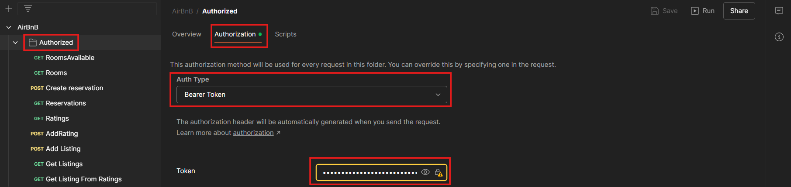
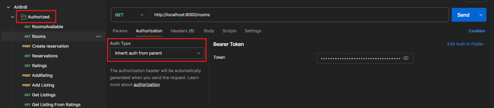

# Konfiguracja Krakend API Gateway

## Jak dodać nowy endpoint do Krakenda?

1. **Otwórz plik `krakend.json`**  
   Plik ten znajduje się w głównym katalogu projektu i zawiera konfigurację wszystkich endpointów obsługiwanych przez Krakend.

2. **Dodaj nowy obiekt w sekcji `endpoints`**  
   Każdy endpoint opisuje trasę, metodę HTTP, sposób mapowania parametrów oraz backend, do którego Krakend przekazuje żądania.

   Przykład nowego endpointu:
   ```json
   {
      "endpoint": "/reservations",
      "method": "GET",
      "output_encoding": "json",
      "backend": [
        {          
          "url_pattern": "/api/reservations",
          "host": ["http://rental-room-service:8081"],
          "encoding": "json",
          "method": "GET",
          "is_collection": true
        }
      ]
    }
   ```
   * enpoint - ścieżka widoczna na zewnątrz
   * url_pattern - ścieżka, na którą Krakend przekazuje żądanie do mikroserwisu
   * host - adres serwisu backendowego
   * is_collection - parametr niezbędny w przypadku zwracania kolekcji (domyślnie ustawiony na false)
     
3. **Zrestartuj Krakend**  
   Po każdej zmianie w pliku krakend.json należy zrestartować usługę Krakend, aby nowe endpointy były dostępne.

# Konfiguracja Kafki

1. **application.properties**
   Kafka jest skonfigurowana w application.properties. 
   Są tam ustawione Serializery i Deserializery. U nas klucz jest Stringiem, a wartość JSONem, stąd StringSerializer i JsonSerizalizer
   Oprócz tego ustawiamy trusted.packages, czyli mówimy Kafce z jakich paczek może deserializować obiekty: u nas to com.airbnb.events

2. **shared-events**
   Eventy muszą być utworzone w module shared-events w folderze events

3. **Do pom.xml modułów wysyłających/odbierających eventy dodaj moduł shared-events**
   ```xml
   <dependency>
   <groupId>com.airbnb</groupId>
   <artifactId>shared-events</artifactId>
   <version>1.0.0</version>
   </dependency>
   ```

4. **Stwórz  klasę "...Event" w shared-events**
   Niech ta klasa zawiera wszystkie atrybuty, które chcesz wysłać na Kafkę
   Przykładowa klasa: ListingCreatedEvent

5. **Stwórz w module wysyłającym klasę (jeśli jeszcze nie istnieje) "...Producer"**
   W tej klasie utwórz metodę send...Event do wysyłania eventu na Kafkę. Event ten to event z shared-events!
   Jeden producer może zawierać wiele metod wysyłających eventy, ale można też mieć kilka producerów w jednym module.
   Wedle uznania trzeba je sensownie pogrupować.
   W miejscu, w którym chcesz wysłać event na Kafkę wywołaj tę metodę.
   Przykładowa klasa: ListingProducer

6. **Stwórz Listener w module nasłuchującym**
   Tak samo jak w przypadku producera, jedna klasa typu Listener może nasłuchiwać wielu topiców, 
   ale można też stworzyć wiele klas typu Listener, wedle uznania trzeba to sensownie podzielić
   Przykładowa klasa: ListingListener

7. **Uruchom Dockera**
   Plik docker-compose.yml uruchamia Kafkę, w application.properties jest zdefiniowany port na którym zostanie uruchomiona (9092)

# Jak uzyskać token JWT?
1. **Otwórz w przeglądarce `localhost:8084/user`**
2. **Zaloguj się przez Google**
3. **Po zalogowaniu otwórz `localhost:8084/token` - powinno ci zwrócić JSON z tokenem JWT w środku**

# Jak wgrać token do Postman?
Żeby nie kopiować i wklejać tokena JWT do każdego requesta najlepiej stworzyć jeden folder w Postman, następnie do tego folderu w zakładce "Authorization" wybrać opcję "Bearer token", i wkleić tam token JWT. 



Następnie requesty tworzyć w tym folderze - requesty wtedy będą dziedziczyć z rodzica (folderu) autoryzację (jest do domyślna opcja w Postman)

